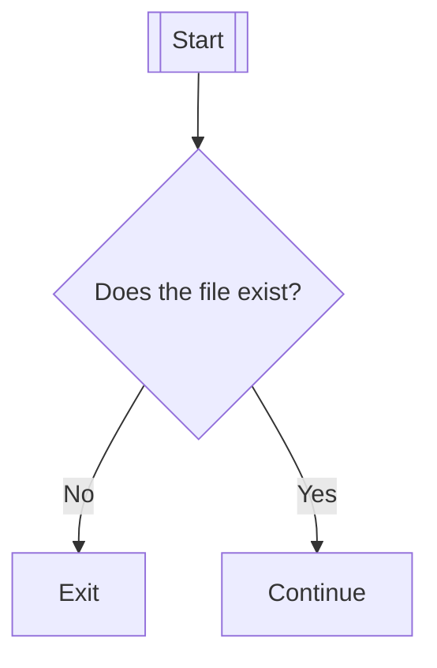
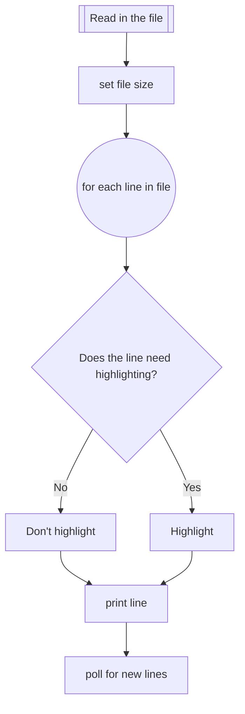
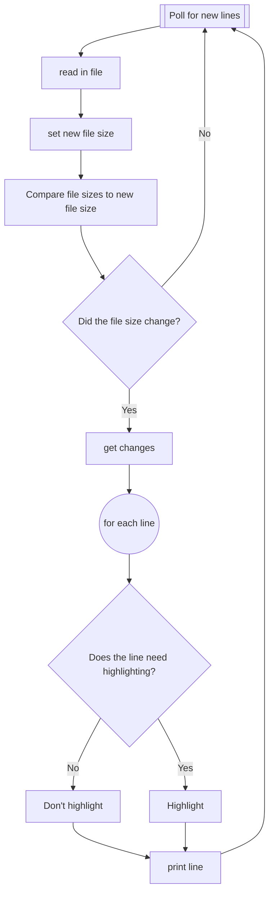

# Tail

## How

How I think the tail function should work.

## Start

To start with, I need to check that the file exists. If the file exists we can
start. If it does not exists then we exit.



## Exists

Ok, so the file exists now what do we do?

Should we read in the whole file or just read the new lines?

We can take a hint from the unix tail function. It prints the last 10 lines.
There is also the -f option which will append the date as the file grows. For my
uses I want to default to appending the data as it grows. Though that doesn't
answer the question.

I think it might be worth printing the whole file and highlighting lines that
I want to standout.



## Poll

When polling for new lines we need to check if the file has changed. If it has grown, get changes. If it shrunk then it truncated, get changes. For each new
line we need to check if it needs highlighting. After we have checked all the lines we can print the new lines and then start the poll process again.



One of the issues I see here is that we are reading in the whole file every time. I do not want to do that. I want to only read in the new lines. I can do
that by keeping track of the file size and using seek. However, I need to figure
out how to get the file size. I can use the stat function to get the file size.
However, it gives me a different size than the what seek needs.

Here is some psudo code for getting the file size and only reading in the new lines.

```golang
oldsize := stat.Size()
st := os.Stat(file)
os.Open(file).Seek(st.Size()-oldsize, 0)

// or
oldsize := st.Size()
st := os.Stat(file) 
f,_ := os.Open(file)
data := make([]byte, st.Size()-oldsize)
f.Read(data)
```
## Truncated

How do I handle when it gets truncated?
